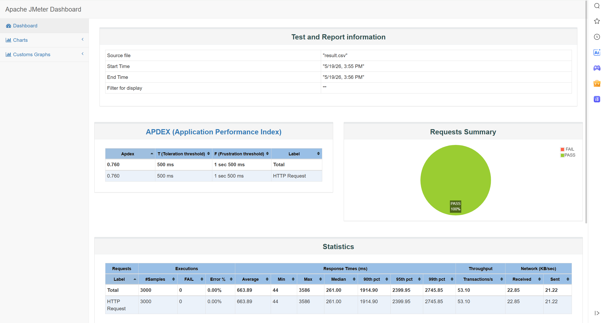

# 分布式博客系统：Redis 缓存点赞高并发优化

本项目在文章点赞和评论点赞场景中，引入 Redis 作为高频写入缓冲层，并通过 MySQL 保存最终一致的点赞状态。核心目标是：在高并发请求下，点赞接口优先完成快速响应，避免每一次点击都直接访问数据库，从而降低数据库写压力并提升用户侧反馈速度。

## 高并发点赞的设计思路

传统点赞接口通常会在一次请求中完成“查询当前状态、更新点赞记录、重新统计数量”等数据库操作。并发升高后，同一篇文章或同一条评论会形成热点行，数据库连接、行锁和统计查询都会成为瓶颈。

当前项目采用“Redis 快速响应 + MySQL 异步落库”的方案：

1. 请求到达点赞接口后，业务层不直接以 MySQL 作为主写路径，而是通过 `LikeCacheCoordinator` 统一处理点赞状态。
2. Redis 保存当前点赞数和用户点赞状态，接口只需要完成内存级读写即可返回。
3. 发生状态变更后，将变更记录写入 Redis 的 `dirty` 集合，表示该用户对该对象的最终状态需要同步到数据库。
4. `LikeFlushWorker` 定时扫描 `dirty` 数据并写入 MySQL，保证最终持久化。
5. 定时校准任务对近期发生过点赞变化的对象进行 Redis/MySQL 计数比对，修正异常情况下的缓存偏差。

这种方式将同步请求路径从“每次都落库”改为“先改缓存、后批量落库”，因此在高并发下可以更快返回点赞结果，同时把数据库写入压力平摊到后台任务中。

## Redis 缓存结构

点赞功能同时支持文章和评论，两类对象共用同一套抽象，通过 `LikeTargetType` 生成不同 Redis key。

文章点赞 key：

- `ns:like:article:count:{articleId}`：文章点赞数缓存。
- `ns:like:article:state:{articleId}`：文章点赞状态 Hash，field 为 `userId`，value 为 `true/false`。
- `ns:like:article:dirty`：待落库的文章点赞变更，field 为 `articleId:userId`。
- `ns:like:article:retry`：落库失败重试次数。
- `ns:like:article:dlq`：超过最大重试次数后的死信队列。
- `ns:like:article:recent`：近期发生过点赞变化的文章 id，用于后续计数校准。

评论点赞 key：

- `ns:like:comment:count:{commentId}`：评论点赞数缓存。
- `ns:like:comment:state:{commentId}`：评论点赞状态 Hash，field 为 `userId`，value 为 `true/false`。
- `ns:like:comment:dirty`：待落库的评论点赞变更，field 为 `commentId:userId`。
- `ns:like:comment:retry`：落库失败重试次数。
- `ns:like:comment:dlq`：超过最大重试次数后的死信队列。
- `ns:like:comment:recent`：近期发生过点赞变化的评论 id，用于后续计数校准。

## 快速响应流程

点赞入口位于：

- `LikeServiceImpl.updateLikeState(...)`：文章点赞。
- `LikeCommentServiceImpl.updateLikeState(...)`：评论点赞。

它们最终都会调用 `LikeCacheCoordinator.toggle(...)`。该方法的执行流程如下：

1. 使用 Redisson 分布式锁 `like_toggle:{type}:{targetId}:{userId}` 锁定同一用户对同一对象的操作，避免重复点击或并发请求导致状态翻转错乱。
2. 调用 `isLiked(...)` 读取当前用户是否已点赞。优先读 Redis；如果 Redis 不存在该用户状态，则从 MySQL 加载并回填 Redis。
3. 调用 `getCount(...)` 读取当前点赞数。优先读 Redis；如果缓存未命中，则从 MySQL 统计并写回 Redis。
4. 计算下一状态 `nextState = !currentState`。
5. 更新 Redis Hash 中的用户点赞状态。
6. 更新 Redis 中的点赞计数，点赞时 `+1`，取消点赞时 `-1`，并用 `Math.max(0, ...)` 避免计数小于 0。
7. 将最终状态写入 `dirty`，等待后台任务同步到 MySQL。
8. 将对象 id 写入 `recent`，后续用于计数校准。
9. 接口立即返回成功。

在这个流程中，接口响应不等待 MySQL 写入完成，因此用户侧可以更快看到点赞状态变化。

## 数据库持久化控制

MySQL 中保留最终的点赞记录：

- `fs_like(article_id, like_user, state, create_time, update_time)`：文章点赞状态。
- `fs_comment_like(comment_id, like_user, state, create_time, update_time)`：评论点赞状态。

项目通过 `LikeStateRepository` 抽象数据库访问：

- `ArticleLikeStateRepository` 负责文章点赞表 `fs_like`。
- `CommentLikeStateRepository` 负责评论点赞表 `fs_comment_like`。

后台任务 `LikeFlushWorker.flush()` 每 10 秒执行一次：

1. 获取分布式锁 `like_flush_worker`，确保多实例部署时同一时间只有一个节点执行落库。
2. 扫描文章和评论的 `dirty` 数据。
3. 对每条 `targetId:userId` 变更调用 `upsertState(...)`。
4. 如果数据库已有记录，则更新 `state` 和 `update_time`。
5. 如果数据库没有记录，则插入新记录。
6. 落库成功后删除对应 `dirty` 和 `retry` 数据。

如果落库失败，系统会累加 `retry` 次数；超过 3 次后写入 `dlq`，避免单条异常数据长期阻塞整个同步流程。

## 缓存与数据库一致性

为了兼顾响应速度和可靠性，项目采用最终一致性策略：

- 正常请求路径以 Redis 为准，保证高并发下快速读写。
- MySQL 作为最终持久化存储，由后台任务异步同步。
- Redis 连接异常时，`LikeCacheCoordinator` 会降级到数据库同步路径，保证点赞功能仍可用。
- `LikeFlushWorker.reconcile()` 每 5 分钟执行一次，扫描 `recent` 中近期变更过的对象。
- 如果某个对象仍存在待落库的 `dirty` 数据，则暂不校准，避免用尚未同步完成的 MySQL 计数覆盖较新的 Redis 计数。
- 如果不存在待落库数据，则重新统计 MySQL 中 `state = true` 的数量，并与 Redis 计数比较；不一致时回写 Redis。

通过这套机制，系统在高并发请求阶段优先保证低延迟，在后台阶段保证数据最终落库和计数修正。

## 高并发测试结果

本次使用 JMeter 对点赞接口进行并发测试，并发数为 500。测试报告截图如下：

从 `report/statistics.json` 和截图可见：

| 指标 | 结果 |
| --- | ---: |
| 并发数 | 500 |
| 总请求数 | 3000 |
| 失败数 | 0 |
| 错误率 | 0.00% |
| 平均响应时间 | 663.89 ms |
| 最小响应时间 | 44 ms |
| 最大响应时间 | 3586 ms |
| 中位数响应时间 | 261 ms |
| 90% 响应时间 | 1914.90 ms |
| 95% 响应时间 | 2399.95 ms |
| 99% 响应时间 | 2745.85 ms |
| 吞吐量 | 53.10 transactions/s |
| APDEX | 0.760 |

测试结果表明，在 500 并发场景下，3000 次点赞请求全部成功，错误率为 0%。点赞请求没有因为高并发而出现失败，说明 Redis 缓冲写入和后台数据库同步机制有效降低了数据库瞬时压力，使接口能够保持可用并快速响应。

## 关键代码位置

- `bbs-springboot/bbs-user/bbs-user-service/src/main/java/com/liang/bbs/user/service/impl/LikeServiceImpl.java`
- `bbs-springboot/bbs-user/bbs-user-service/src/main/java/com/liang/bbs/user/service/impl/LikeCommentServiceImpl.java`
- `bbs-springboot/bbs-user/bbs-user-service/src/main/java/com/liang/bbs/user/service/like/LikeCacheCoordinator.java`
- `bbs-springboot/bbs-user/bbs-user-service/src/main/java/com/liang/bbs/user/service/like/LikeTargetType.java`
- `bbs-springboot/bbs-user/bbs-user-service/src/main/java/com/liang/bbs/user/service/like/ArticleLikeStateRepository.java`
- `bbs-springboot/bbs-user/bbs-user-service/src/main/java/com/liang/bbs/user/service/like/CommentLikeStateRepository.java`
- `bbs-springboot/bbs-user/bbs-user-service/src/main/java/com/liang/bbs/user/service/scheduler/LikeFlushWorker.java`
- `bbs-springboot/bbs-common/src/main/java/com/liang/bbs/common/constant/RedisConstants.java`
- `bbs-springboot/db/open_bbs.sql`

整体来看，本项目的点赞优化不是简单地把点赞数放入 Redis，而是将“状态缓存、计数缓存、脏数据队列、失败重试、死信队列、定时落库、定时校准、Redis 异常降级”组合起来，形成了一套适合高并发点赞场景的快速响应方案。
